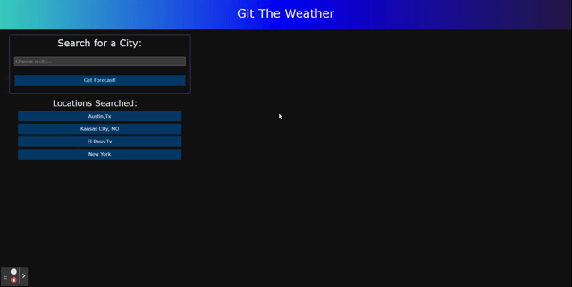

# Git The Weather
#### REST API 
 

https://rbodil.github.io/Git-The-Weather/

## With Git-the-Weather you can:
* Find any city
* Get that day's weather data
* Get the next 5 day forecast
* See past searches
* See the easy to interpret UV index

 

